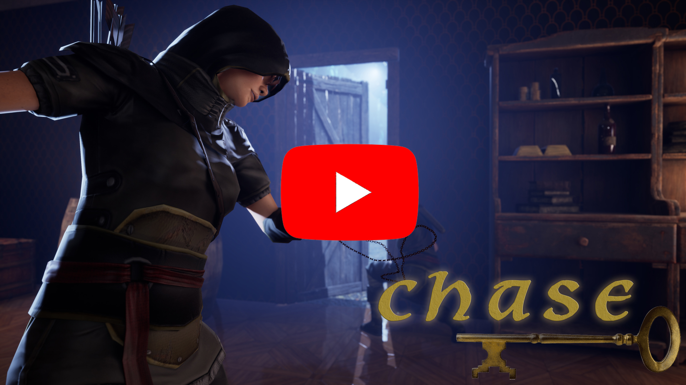
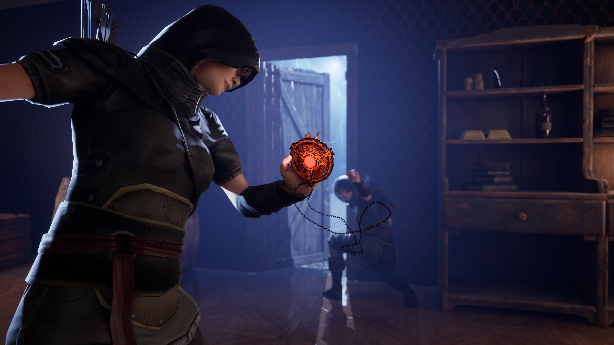
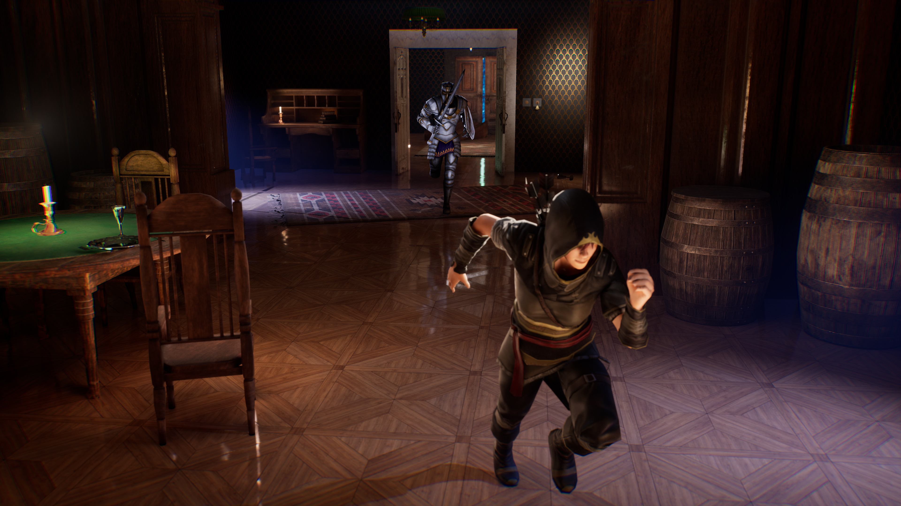
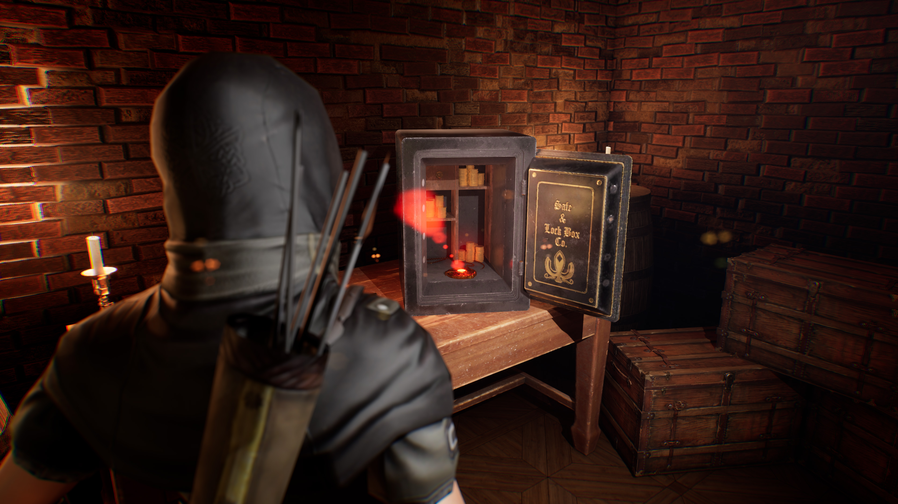

 
# Chase
## English description is below
## Тизер игры (Eng sub)

**Chase** — это напряжённый стелс-симулятор от первого лица, где вы играете за вора, вынужденного принимать сложные решения в самых неудобных ситуациях. 

Вместе с адаптивным напарником вы отправляетесь на опасную миссию, чтобы найти легендарный Рубиновый медальон. Планируйте свои действия, обыскивайте тайники, прикрывайте друг друга — но помните: один неверный шаг — и придётся бежать. 
Ссылка на скачивание GameJolt: https://gamejolt.com/games/Chase/1032669

 
##  Механики:

 **Ваш напарник** – не просто запрограммированный спутник, а умный ИИ, который анализирует ваш стиль игры и подстраивается под него. Если вы действуете скрытно, помощник будет тише и осторожнее; если идёте напролом, он станет агрессивнее. 

 

 **Режим тревоги** – динамичная система, где опасность может настигнуть вас внезапно или постепенно нарастать, запуская обратный отсчет. Ваши действия определяют исход: предотвратите угрозу вовремя или попытайтесь выиграть время, пока таймер не истек. 

 

 **Контроль освещения** – управляйте светом, чтобы снизить уровень тревоги, однако будьте готовы к последствиям: в темноте ваш напарник замедлит работу или вовсе остановится. Найдите баланс между скрытностью и эффективностью! 

  

 **Механики предотвращения** – используйте навыки и ресурсы, чтобы снизить уровень тревоги, находите способы замедлить таймер или даже полностью его остановить. Но будьте осторожны – каждый шаг имеет последствия. 

  

 **Секретные тайники** – на уровнях спрятаны закрытые хранилища с ценными предметами. Найдите их, чтобы получить преимущество, но помните – поиски могут привлечь лишнее внимание. 

  

 **Система оценки** – ваши решения и скорость влияют на результат. Проходите уровень чисто и быстро, чтобы получить высшую награду, или действуйте осторожно, но рискуя потерять баллы. 

## 📸 Скриншоты  

|  |  |  
|--------------------------------------|--------------------------------------| 
|  |  | 
|  |  | 
 

 
**Язык**: Blueprints (визуальное программирование)  

## � Установка и запуск  

1. Скачайте проект (`git clone https://github.com/Grizly401/GameJam`).  
2. Откройте `.uproject` файл в Unreal Engine 5.3.  
3. Нажмите **Play** в редакторе.  

📌 **Важно**: Для работы требуется Unreal Engine 5.3 (скачать можно с [официального сайта](https://www.unrealengine.com/)).  

## 🎮 Управление  

 
 **WASD** — движение  
 
 **Е** — взаимодействие  
 
 **P** — пауза  

 

  

## English description
  

 
**Chase** — is a first-person stealth simulator where you play as a thief, forced to make difficult decisions in the most awkward situations.
 
You go on a dangerous mission with your partner to find the legendary Ruby Medallion. Plan your actions, search hiding places, cover each other - but remember: one wrong step and you will have to run.  

 
##  Mechanics:

 **Your partner** – Is not just a programmed companion, but a smart AI that analyzes your play style and adapts to it. If you act stealthily, the partner will be quieter and more careful; if you go straight ahead, she will become more aggressive. 

 

 **Alert mode** – Is a dynamic system where danger can strike you suddenly or gradually increase, triggering a countdown. Your actions determine the outcome: prevent the threat in time or try to buy time before the timer runs out. 

 

 **Lighting Control** – Manage the light to reduce alert, but be prepared for the consequences: your partner will slow down or even stop working in the dark. Find a balance between stealth and efficiency! 

  

 **Prevention Mechanics** – Use skills and resources to reduce alert. Find ways to slow down the timer or even stop it completely. But be careful – every step has consequences. 

  

 **Secret Stashes** – There are locked storage areas with valuable items hidden throughout the levels. Find them to gain an advantage, but beware – searching may attract unwanted attention. 

  

 **Score system** – your decisions and speed affect the outcome. Complete the level cleanly and quickly to get the highest reward or play it safe and risk losing points. 

## � Installation and Launch 

1. Download the project (`git clone https://github.com/Grizly401/GameJam`).  
2. Open .uproject file in Unreal Engine 5.3
3. Press **Play** in the editor

📌 **Important**: You can download Unreal Engine 5.3 on the official website. (https://www.unrealengine.com/).  

## 🎮 Control Keys  

 
 **WASD** — Move
 
 **Е** — Interaction  
 
 **P** — Pause  

 

## 📜 Лицензия/License

**Royalty free Music License:** 

Music: Waves of Treasure by Alexander Nakarada (https://www.creatorchords.com)
Licensed under Creative Commons BY Attribution 4.0 License
https://creativecommons.org/licenses/by/4.0/

Music: Mjolnir by Alexander Nakarada (https://www.creatorchords.com)
Licensed under Creative Commons BY Attribution 4.0 License
https://creativecommons.org/licenses/by/4.0/

Chase by Alexander Nakarada (CreatorChords) | https://creatorchords.com
Music promoted by https://www.free-stock-music.com
Creative Commons / Attribution 4.0 International (CC BY 4.0)
https://creativecommons.org/licenses/by/4.0/

Music: Suspensify by Alexander Nakarada (https://www.creatorchords.com)
Licensed under Creative Commons BY Attribution 4.0 License
https://creativecommons.org/licenses/by/4.0/
